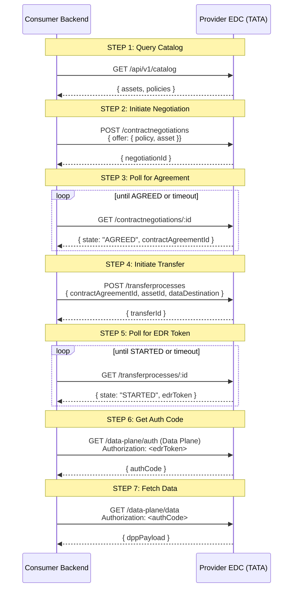

# Flow: EDC Sovereign Data Negotiation

Eclipse Dataspace Connector (EDC) is the core data exchange mechanism. Before any data is transferred, a contract must be negotiated. This 7-step process ensures sovereignty — data providers set ODRL access policies, and consumers must explicitly agree before receiving any data.

This flow is invoked as Step 9 of the [Insurance VP Verification](insurance-verification.md) flow, and also directly via `POST /api/edc/negotiate`.

---

## Why EDC?

In a traditional API, you'd just call `GET /vehicle-data/:vin` with an API key. EDC enforces that:

1. **Data stays sovereign** — the provider controls who can access what, via ODRL policies
2. **Access is auditable** — every contract negotiation is recorded
3. **Standards-based** — works across organizations and jurisdictions without bilateral agreements

---

## Actors

| Actor                        | Role                            |
| ---------------------------- | ------------------------------- |
| Consumer (Digit/Backend)     | Requests data access            |
| Provider (TATA EDC)          | Controls data assets + policies |
| Backend `edcConsumerService` | Orchestrates all 7 steps        |

---

## 7-Step Negotiation Flow



---

## Step-by-Step Detail

### Step 1: Query Catalog

The consumer fetches the provider's catalog to find matching assets.

```typescript
const catalog = await axios.get(`${providerDspUrl}/catalog`, {
    headers: { "x-api-key": EDC_API_KEY },
    params: { "filter[asset:prop:id]": assetId },
})
```

The catalog response lists available assets with their associated ODRL access policies and usage policies. The consumer identifies the asset ID and the policy IDs to use in the negotiation.

### Step 2: Initiate Contract Negotiation

Send a contract offer to the provider:

```typescript
const negotiation = await axios.post(`${EDC_CONSUMER_MANAGEMENT_URL}/v2/contractnegotiations`, {
    "@context": { edc: "https://w3id.org/edc/v0.0.1/ns/" },
    connectorId: providerBpn,
    connectorAddress: `${providerDspUrl}`,
    protocol: "dataspace-protocol-http",
    offer: {
        offerId: `${policyId}:${assetId}:${hash}`,
        assetId: assetId,
        policy: accessPolicy, // from catalog
    },
})
// Response: { "@id": "negotiation-uuid" }
```

### Step 3: Poll for Agreement

The negotiation is asynchronous. Poll until state is `AGREED`:

```typescript
let state = "REQUESTED"
while (state !== "AGREED") {
    await sleep(EDC_NEGOTIATION_POLL_INTERVAL_MS) // default: 5s
    const result = await axios.get(`${EDC_CONSUMER_MANAGEMENT_URL}/v2/contractnegotiations/${negotiationId}`)
    state = result.data["edc:state"]

    if (state === "TERMINATED") throw new Error("Negotiation terminated by provider")
}
const contractAgreementId = result.data["edc:contractAgreementId"]
```

Possible states: `REQUESTED` → `OFFERED` → `AGREED` → `VERIFIED` → `FINALIZED` (or `TERMINATED`)

### Step 4: Initiate Data Transfer

```typescript
const transfer = await axios.post(`${EDC_CONSUMER_MANAGEMENT_URL}/v2/transferprocesses`, {
    assetId: assetId,
    contractId: contractAgreementId,
    connectorAddress: providerDspUrl,
    connectorId: providerBpn,
    protocol: "dataspace-protocol-http",
    dataDestination: { type: "HttpProxy" },
})
// Response: { "@id": "transfer-uuid" }
```

`HttpProxy` destination means we want to pull the data ourselves (vs. push to a destination).

### Step 5: Poll for EDR Token

Poll until state is `STARTED` and an EDR (Endpoint Data Reference) token is available:

```typescript
let transferState = "INITIAL"
while (transferState !== "STARTED") {
    await sleep(EDC_NEGOTIATION_POLL_INTERVAL_MS)
    const result = await axios.get(`${EDC_CONSUMER_MANAGEMENT_URL}/v2/transferprocesses/${transferId}`)
    transferState = result.data["edc:state"]
}
const edrToken = result.data["edc:dataAddress"]["edc:authorization"]
```

### Step 6: Get Authorization Code

Exchange the EDR token for a short-lived auth code from the provider's data plane:

```typescript
const authResponse = await axios.get(`${providerDataPlaneUrl}/public`, { headers: { Authorization: edrToken } })
const authCode = authResponse.data.token
```

### Step 7: Fetch Data

Use the auth code to retrieve the actual DPP data:

```typescript
const dataResponse = await axios.get(`${providerDataPlaneUrl}/public/data`, { headers: { Authorization: `Bearer ${authCode}` } })
return dataResponse.data // DPP payload
```

---

## SSE Streaming

For browser clients, the negotiation progress is streamed via Server-Sent Events:

```
POST /api/edc/negotiate
Accept: text/event-stream

data: {"step":1,"status":"querying_catalog","message":"Fetching provider catalog..."}
data: {"step":2,"status":"negotiating","message":"Contract offer sent"}
data: {"step":3,"status":"polling_agreement","message":"Waiting for agreement..."}
data: {"step":3,"status":"polling_agreement","attempt":2}
data: {"step":4,"status":"initiating_transfer"}
data: {"step":5,"status":"polling_edr"}
data: {"step":6,"status":"getting_auth"}
data: {"step":7,"status":"fetching_data"}
data: {"step":7,"status":"complete","data":{...}}
```

The `onProgress` callback in `edcConsumerService.ts` handles writing these events.

---

## Configuration

| Env Var                            | Default    | Description                                   |
| ---------------------------------- | ---------- | --------------------------------------------- |
| `ENABLE_EDC`                       | `true`     | Feature flag. Set `false` to return mock data |
| `EDC_BASE_URL`                     | —          | Provider control plane URL                    |
| `EDC_API_KEY`                      | —          | Provider API key                              |
| `EDC_CONSUMER_MANAGEMENT_URL`      | —          | Consumer control plane URL                    |
| `BPN_NUMBER`                       | —          | Our consumer BPNL                             |
| `EDC_ACCESS_POLICY_ID`             | `policy_2` | Access policy to request                      |
| `EDC_CONTRACT_POLICY_ID`           | `policy_2` | Contract policy to use                        |
| `EDC_NEGOTIATION_INITIAL_DELAY_MS` | `5000`     | Delay before first poll                       |
| `EDC_NEGOTIATION_POLL_INTERVAL_MS` | `5000`     | Interval between polls                        |
| `EDC_NEGOTIATION_MAX_RETRIES`      | `3`        | Max poll attempts per step                    |

---

## Transaction Records

Every negotiation creates an `EdcTransaction` record:

```typescript
{
  id: "txn-uuid",
  providerDspUrl: "https://tata-motors-controlplane...",
  providerBpn: "BPNL00000000024R",
  assetId: "asset_dpp_1HGBH41",
  status: "completed",
  currentStep: 7,
  steps: [
    { step: 1, status: "ok", timestamp: "..." },
    { step: 2, negotiationId: "...", status: "ok" },
    { step: 3, contractAgreementId: "...", attempts: 2, status: "ok" },
    // ...
  ],
  contractId: "agreement-uuid",
  transferId: "transfer-uuid",
  data: { /* DPP */ },
  startedAt: "...",
  completedAt: "..."
}
```

View via `GET /api/edc/transactions` and `GET /api/edc/transactions/:id`.

---

## Failure Scenarios

| Scenario                     | Behavior                                                |
| ---------------------------- | ------------------------------------------------------- |
| Provider catalog unreachable | Step 1 fails, `EdcTransaction.status = "failed"`        |
| Negotiation terminated       | Step 3 throws, reason logged in transaction steps       |
| Polling timeout exceeded     | `EDC_NEGOTIATION_MAX_RETRIES` exhausted, error returned |
| Data plane auth rejected     | Step 6 fails with 401                                   |
| Data fetch returns empty     | Step 7 completes but `data` is null                     |

> **Debug tip:** Use `GET /api/edc/transactions/:id` to inspect the `steps` array. Each step records its response body, so you can see exactly what the EDC returned.

---

## ENABLE_EDC=false (Mock Mode)

When `ENABLE_EDC=false`, the negotiation skips all EDC calls and returns synthetic DPP data after a simulated 3-second delay. Useful for frontend development without real EDC infrastructure.

---

## Related

- [docs/flows/insurance-verification.md](insurance-verification.md) — EDC negotiation is Step 9 of this flow
- [docs/backend.md#edc](../backend.md#edc) — `/api/edc/negotiate` API reference
- [docs/database.md](../database.md) — `EdcTransaction` model
