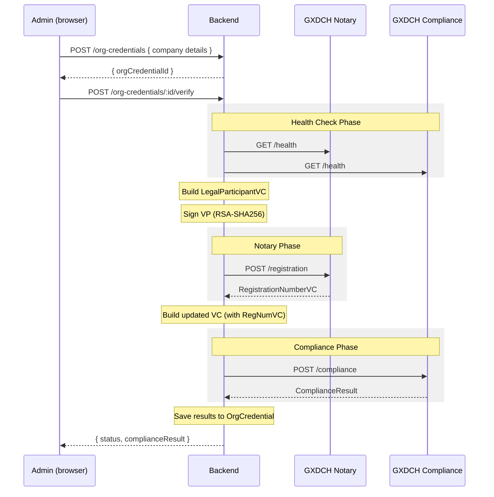

# Flow: Gaia-X Organization Compliance Verification

Before an organization can participate in the dataspace, it must prove its identity and compliance with Gaia-X standards. This flow registers an organization with the Gaia-X Digital Clearing House (GXDCH), receives a compliance credential, and stores the result.

---

## Actors

| Actor                       | Role                                                  |
| --------------------------- | ----------------------------------------------------- |
| Company Admin               | Submits org details, triggers verification            |
| Backend `GaiaXOrchestrator` | Builds VCs, signs VPs, calls GXDCH APIs               |
| GXDCH Notary API            | Issues RegistrationNumberVC                           |
| GXDCH Compliance API        | Validates LegalParticipantVC, issues ComplianceResult |

---

## Flow Diagram



---

## Step-by-Step

### Step 1: Create OrgCredential

**Portal:** `portal-dataspace` → `CreateOrgCredential`

The admin fills in organization details:

```http
POST /api/org-credentials
{
  "companyId": "company-uuid",
  "vatId": "DE123456789",
  "eoriNumber": "DE1234567890",
  "cin": "U12345MH2020PTC123456",
  "leiCode": "5299001VER4RZPIG5734",
  "legalAddress": {
    "street": "Musterstraße 1",
    "city": "Berlin",
    "postalCode": "10115",
    "countryCode": "DE"
  },
  "headquartersAddress": {
    "street": "Musterstraße 1",
    "city": "Berlin",
    "postalCode": "10115",
    "countryCode": "DE"
  }
}
```

Creates an `OrgCredential` record with `status: "pending"`.

### Step 2: Trigger Verification

The admin clicks "Verify Organization":

```http
POST /api/org-credentials/:id/verify
```

This calls `GaiaXOrchestrator.verifyOrganization(orgCredentialId)`.

### Step 3: Health Check Endpoints

The orchestrator tests all configured GXDCH endpoints before selecting which set to use:

```typescript
const healthySet = await orchestrator.selectHealthyEndpoints([
    { notary: "https://notary.gxdch.eu", compliance: "https://compliance.gxdch.eu" },
    { notary: "https://notary.gxfs.gx4fm.org", compliance: "https://compliance.gxfs.gx4fm.org" },
])
```

If all endpoints fail, the orchestrator throws and the `OrgCredential` is marked `status: "error"`.

**Mock mode** (`GAIAX_MOCK_MODE=true`): This step is skipped. A synthetic "all healthy" response is returned immediately.

### Step 4: Build LegalParticipantVC

`vc-builder.ts` constructs the Gaia-X Legal Participant credential:

```json
{
    "@context": [
        "https://www.w3.org/2018/credentials/v1",
        "https://registry.lab.gaia-x.eu/development/api/trusted-shape-registry/v1/shapes/jsonld/trustframework#"
    ],
    "type": ["VerifiableCredential", "gx:LegalParticipant"],
    "issuer": "did:web:jeh-api.tx.the-sense.io",
    "issuanceDate": "2026-03-20T10:00:00Z",
    "credentialSubject": {
        "id": "did:web:jeh-api.tx.the-sense.io",
        "gx:legalName": "TATA Motors Limited",
        "gx:registrationNumber": {
            "gx:vatID": "DE123456789",
            "gx:EORI": "DE1234567890",
            "gx:leiCode": "5299001VER4RZPIG5734"
        },
        "gx:legalAddress": {
            "gx:countrySubdivisionCode": "DE-BE",
            "@type": "gx:Address"
        },
        "gx:headquartersAddress": {
            "gx:countrySubdivisionCode": "DE-BE",
            "@type": "gx:Address"
        },
        "gx:termsAndConditions": {
            "gx:URL": "https://registry.lab.gaia-x.eu/development/api/trusted-shape-registry/v1/shapes/jsonld/trustframework#",
            "gx:hash": "70c1d7a8618d..."
        }
    }
}
```

Also builds a `TermsAndConditionsVC` (required by Gaia-X compliance endpoint).

### Step 5: Sign VP

`vp-signer.ts` generates an RSA-2048 keypair (or loads existing) and signs a Verifiable Presentation containing both VCs:

```typescript
const keypair = await generateOrLoadRsaKeypair()
const vp = {
    "@context": ["https://www.w3.org/2018/credentials/v1"],
    type: ["VerifiablePresentation"],
    verifiableCredential: [legalParticipantVc, termsAndConditionsVc],
}
const signedVp = await signVP(vp, keypair, "RS256")
```

The signature uses `RS256` (RSA + SHA-256).

### Step 6: Submit to Notary API

```http
POST https://notary.gxdch.eu/registration
Content-Type: application/json

{
  "selfDescription": <signed VP>
}
```

Response: `RegistrationNumberVC` — a credential from the notary confirming the organization is registered.

### Step 7: Submit to Compliance API

The compliance submission includes the LegalParticipantVC + TermsAndConditionsVC + RegistrationNumberVC:

```http
POST https://compliance.gxdch.eu/compliance
Content-Type: application/json

{
  "selfDescription": <VP with 3 VCs>
}
```

Response: `ComplianceResult`:

```json
{
  "type": ["VerifiableCredential", "gx:ComplianceCredential"],
  "credentialSubject": {
    "gx:integrity": "sha256-...",
    "gx:version": "22.10",
    "gx:type": "gx:LegalParticipant",
    "gx:id": "did:web:jeh-api.tx.the-sense.io",
    "gx:registrationNumber": [...]
  },
  "proof": { ... }
}
```

### Step 8: Persist Results

The backend updates the `OrgCredential` record:

```typescript
await prisma.orgCredential.update({
    where: { id: orgCredentialId },
    data: {
        status: "compliant", // or "non_compliant"
        legalParticipantVc: legalParticipantVcJson,
        notaryResult: registrationNumberVc,
        complianceResult: complianceCredential,
        issuedVc: complianceCredential,
        verifiedAt: new Date(),
    },
})
```

---

## Viewing Results

**Portal:** `portal-dataspace` → `OrgCredentialDetail`

The detail page shows:

- Verification status badge (compliant / non-compliant / pending / error)
- Notary result (registration number VC)
- Compliance result (Gaia-X compliance credential)
- Issued VC (downloadable)
- Error details if verification failed

---

## Mock Mode

When `GAIAX_MOCK_MODE=true` (default for local dev):

1. Health checks return `{ status: "ok" }` instantly
2. Notary returns a synthetic `RegistrationNumberVC`
3. Compliance returns a synthetic `ComplianceResult` with `status: "compliant"`
4. No external HTTP calls are made

This lets you test the full Gaia-X UI flow without real GXDCH credentials.

```env
GAIAX_MOCK_MODE=true   # development default
GAIAX_MOCK_MODE=false  # required for production
```

---

## Failure Scenarios

| Scenario                               | Behavior                                                      |
| -------------------------------------- | ------------------------------------------------------------- |
| All GXDCH endpoints unreachable        | `OrgCredential.status = "error"`, health check results logged |
| Notary API rejects submission          | `status = "error"`, notary error stored in `errorDetails`     |
| Compliance API returns non-compliant   | `status = "non_compliant"`, full result stored                |
| Missing required fields (VAT, address) | `400` returned before orchestrator runs                       |
| RSA key generation fails               | `500` — rare, check disk permissions                          |

---

## Related

- [docs/backend.md#organization-credentials](../backend.md#organization-credentials-gaia-x) — API reference
- [docs/database.md](../database.md) — `OrgCredential`, `Company` models
- [docs/architecture.md#compliance-layer](../architecture.md#compliance-layer) — Design overview
