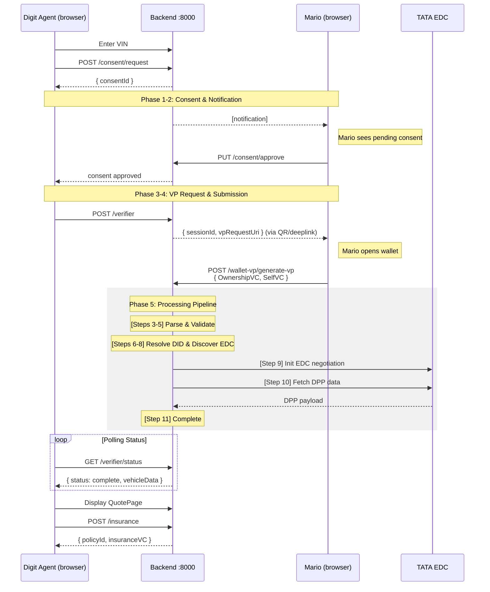

# Flow: Insurance VP Verification

This is the most complex flow in the platform. A Digit Insurance agent wants to underwrite a vehicle. Instead of requesting raw data directly, they initiate an OpenID4VP (Verifiable Presentation) flow: the vehicle owner presents credentials, the backend verifies them, discovers the provider's EDC endpoint from the issuer's DID document, negotiates a data contract, and fetches the DPP.

The whole process takes ~30–60 seconds and involves 11 tracked pipeline steps.

---

## Actors

| Actor           | System             | Role                                 |
| --------------- | ------------------ | ------------------------------------ |
| Digit Agent     | `portal-insurance` | Initiates verification, receives DPP |
| Mario Sanchez   | `portal-wallet`    | Vehicle owner, presents VP           |
| Backend         | `backend`          | Orchestrates the entire pipeline     |
| TATA Motors EDC | External           | Data provider (DPP holder)           |

---

## Flow Diagram



---

## Step-by-Step

### Phase 1: Consent Request

**Portal:** `portal-insurance` → `VinLookup`

```http
POST /api/consent/request
{
  "requesterId": "digit-agent",
  "ownerId": "mario-sanchez",
  "vin": "1HGBH41JXMN109186",
  "purpose": "insurance_underwriting"
}
```

Response: `{ "consentId": "abc-123" }`

The portal transitions to `ConsentWait`, polling `GET /api/consent/check?requesterId=digit-agent&ownerId=mario-sanchez&vin=...` every 5 seconds.

### Phase 2: Owner Approval

**Portal:** `portal-wallet` → Consent modal

Mario's wallet polls `GET /api/consent/pending/mario-sanchez` and shows the pending consent as a modal. Mario clicks "Approve".

```http
PUT /api/consent/abc-123/approve
```

The backend:

1. Updates `Consent.status = "approved"`
2. Creates an `AccessSession` (1-hour TTL)

The insurance portal's polling detects approval and proceeds.

### Phase 3: VP Request Creation

**Portal:** `portal-insurance` → `VPInsuranceFlow`

```http
POST /api/verifier
{
  "requesterId": "digit-agent",
  "vin": "1HGBH41JXMN109186",
  "expectedTypes": ["OwnershipVC", "SelfVC"],
  "purpose": "insurance_underwriting"
}
```

Response:

```json
{
    "sessionId": "sess-456",
    "vpRequestUri": "openid4vp://authorize?request_uri=..."
}
```

The portal shows a QR code / deep-link with the `vpRequestUri`.

### Phase 4: VP Submission

**Portal:** `portal-wallet` → `PresentationRequest`

Mario opens his wallet (via QR scan or deep-link), selects his `OwnershipVC` and `SelfVC`, then clicks "Present".

The wallet calls:

```http
POST /api/wallet-vp/generate-vp
{
  "userId": "mario-sanchez",
  "credentialTypes": ["OwnershipVC", "SelfVC"],
  "sessionId": "sess-456",
  "challenge": "<nonce from session>",
  "domain": "https://jeh-insurance.tx.the-sense.io"
}
```

The backend generates a signed VP and submits it to the verifier pipeline.

### Phase 5: VP Processing Pipeline (Steps 1–11)

The backend processes the VP through 11 tracked steps, updating `PresentationSession.steps` after each:

| Step | Name                   | What happens                                                |
| ---- | ---------------------- | ----------------------------------------------------------- |
| 1    | `create_request`       | PresentationRequest record created                          |
| 2    | `await_vp`             | Waiting for owner to submit VP                              |
| 3    | `parse_vp`             | Deserialize VP JWT/JSON-LD                                  |
| 4    | `extract_credentials`  | Pull credentials array out of VP                            |
| 5    | `validate_proof`       | Verify VP proof signature                                   |
| 6    | `resolve_did`          | Resolve issuer DID (`did:web:tata.example.com`)             |
| 7    | `discover_dataservice` | Find `DataService` in DID document's `service` array        |
| 8    | `extract_edc_url`      | Parse EDC DSP URL + BPNL from `DataService.serviceEndpoint` |
| 9    | `edc_negotiate`        | Run 7-step EDC contract negotiation (sub-flow)              |
| 10   | `fetch_dpp`            | Fetch DPP data from provider's data plane                   |
| 11   | `complete`             | Store `vehicleData` on session, mark complete               |

### Phase 6: Poll for Results

The insurance portal polls `GET /api/verifier/sess-456/status` every 3 seconds:

```json
{
    "status": "processing",
    "currentStep": 9,
    "stepName": "edc_negotiate"
}
```

When step 11 completes:

```json
{
  "status": "complete",
  "vehicleData": {
    "vin": "1HGBH41JXMN109186",
    "powertrain": { "type": "BEV", "batteryCapacity": 40.5 },
    "emissions": { "co2": 0, "euroStandard": "BEV" },
    "damageHistory": [],
    "serviceHistory": [...]
  }
}
```

### Phase 7: Premium Calculation & Policy Issuance

**Portal:** `portal-insurance` → `QuotePage`

The portal displays a transparent premium breakdown using DPP fields. The agent confirms and the portal calls:

```http
POST /api/insurance
{
  "vin": "1HGBH41JXMN109186",
  "holderId": "mario-sanchez",
  "agentId": "digit-agent",
  "coverageType": "comprehensive",
  "premiumBreakdown": {
    "base": 800,
    "batteryRisk": -50,
    "noDamageDiscount": -40,
    "serviceBonus": -30
  }
}
```

The backend:

1. Creates `InsurancePolicy` record
2. Issues `InsuranceVC` via walt.id
3. Stores VC in Mario's wallet
4. Returns `{ policyId, policyNumber, insuranceVC }`

---

## DID-Based EDC Discovery

A key architectural feature: the backend doesn't need to know TATA's EDC URL in advance. It discovers it dynamically from the credential's issuer DID.

```
OwnershipVC.issuer = "did:web:tata-admin.tx.the-sense.io"
                              │
                              ▼
GET https://tata-admin.tx.the-sense.io/.well-known/did.json
{
  "id": "did:web:tata-admin.tx.the-sense.io",
  "service": [
    {
      "id": "#edc-dsp",
      "type": "DataService",
      "serviceEndpoint": {
        "dspUrl": "https://tata-motors-controlplane.tx.the-sense.io/api/v1/dsp",
        "bpn": "BPNL00000000024R"
      }
    }
  ]
}
```

This `dspUrl` and `bpn` are then used to initiate the EDC negotiation. See [docs/flows/edc-negotiation.md](edc-negotiation.md).

---

## Failure Scenarios

| Scenario                  | Step | Behavior                                                           |
| ------------------------- | ---- | ------------------------------------------------------------------ |
| Owner denies consent      | 2    | Portal shows "access denied" message                               |
| VP proof invalid          | 5    | Session marked `error`, frontend shows rejection reason            |
| DID document not found    | 6    | Session marked `error`, "could not resolve issuer DID"             |
| No DataService in DID doc | 7    | Session marked `error`, "no EDC endpoint discovered"               |
| EDC negotiation times out | 9    | Session marked `error`, transaction record preserved for debugging |
| DPP data fetch fails      | 10   | Session marked `error`, partial transaction recorded               |

The insurance portal can call `GET /api/verifier/:sessionId/steps` to get detailed error info for any step.

---

## Related

- [docs/flows/edc-negotiation.md](edc-negotiation.md) — Step 9 detail
- [docs/flows/consent-access.md](consent-access.md) — Phase 1 & 2 detail
- [docs/backend.md#verifier](../backend.md#verifier-openid4vp) — API reference
- [docs/database.md](../database.md) — `PresentationRequest`, `PresentationSession` models
