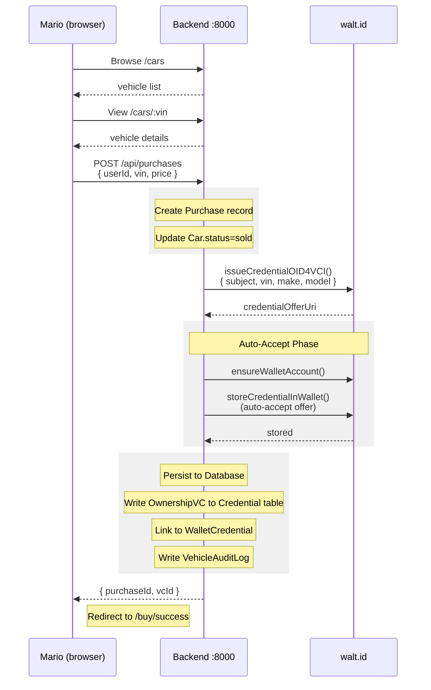

# Flow: Vehicle Purchase & OwnershipVC Issuance

When a customer buys a vehicle on the public showroom, they immediately receive a Verifiable Credential (OwnershipVC) in their digital wallet. This credential proves ownership and is used in downstream flows (insurance, data access).

---

## Actors

| Actor          | System                          | Role              |
| -------------- | ------------------------------- | ----------------- |
| Mario Sanchez  | `portal-tata-public`            | Buyer             |
| TATA Backend   | `backend` + `waltid-issuer-api` | Credential issuer |
| walt.id wallet | `waltid-wallet-api`             | Credential store  |

---

## Flow Diagram



---

## Step-by-Step

### 1. Browse and Select

Mario opens `portal-tata-public` (http://localhost:3003) and browses available vehicles via `GET /api/cars`. He clicks on a vehicle to view specs and DPP summary.

### 2. Purchase Request

Mario clicks "Buy Now". The portal sends:

```http
POST /api/purchases
Authorization: Bearer <jwt>
Content-Type: application/json

{
  "userId": "mario-sanchez",
  "vin": "1HGBH41JXMN109186",
  "dealerName": "TATA Direct",
  "price": 45000
}
```

### 3. Backend Processing

The backend:

1. Creates a `Purchase` record in PostgreSQL
2. Updates `Car.status` to `"sold"`
3. Writes a `VehicleAuditLog` entry: `{ action: "purchased", actorId: "mario-sanchez" }`

### 4. OwnershipVC Issuance

The backend calls `waltid.issueCredentialOID4VCI()`:

```typescript
const offerUri = await issueCredentialOID4VCI({
    subjectDid: `did:key:${mario.userId}`,
    credentialType: "OwnershipVC",
    claims: {
        vin: "1HGBH41JXMN109186",
        make: "Tata Motors",
        model: "Nexon EV",
        year: 2024,
        purchaseDate: new Date().toISOString(),
        owner: "Mario Sanchez",
    },
})
```

This returns a `openid-credential-offer://...` URI — an OID4VCI credential offer.

### 5. Auto-Accept into Wallet

Instead of requiring Mario to scan a QR code, the backend auto-accepts the offer on his behalf:

```typescript
const walletId = await ensureWalletAccount(mario.userId)
await storeCredentialInWallet(walletId, offerUri)
```

The credential is now in Mario's walt.id wallet.

### 6. Persist to Database

The backend:

1. Creates a `Credential` record with `type: "OwnershipVC"` and the full VC JSON
2. Links it to Mario's `Wallet` via a `WalletCredential` record
3. Updates the `Purchase` record with `credentialId`
4. Returns `{ purchaseId, credentialId }` to the frontend

### 7. Confirmation

`portal-tata-public` redirects to `/buy/success` with a link to `portal-wallet` so Mario can view his new credential.

---

## Credential Structure

The issued `OwnershipVC` follows W3C VC v2 format:

```json
{
    "@context": ["https://www.w3.org/2018/credentials/v1", "https://w3id.org/vehicle/v1"],
    "type": ["VerifiableCredential", "OwnershipVC"],
    "issuer": "did:web:tata-admin.tx.the-sense.io",
    "issuanceDate": "2026-03-20T10:00:00Z",
    "credentialSubject": {
        "id": "did:key:mario-sanchez",
        "vin": "1HGBH41JXMN109186",
        "make": "Tata Motors",
        "model": "Nexon EV",
        "year": 2024,
        "purchaseDate": "2026-03-20T10:00:00Z",
        "owner": "Mario Sanchez"
    },
    "proof": {
        "type": "JsonWebSignature2020",
        "verificationMethod": "did:web:tata-admin.tx.the-sense.io#key-1",
        "jws": "eyJhbGc..."
    }
}
```

---

## Failure Scenarios

| Scenario                      | Behavior                                                |
| ----------------------------- | ------------------------------------------------------- |
| VIN not found                 | `404` — Purchase rejected                               |
| Car already sold              | `409` — "Vehicle no longer available"                   |
| walt.id unavailable           | `500` — Purchase recorded, VC issuance queued for retry |
| Wallet account creation fails | `500` — Transaction rolled back                         |

> **Design Note:** In the current implementation, if walt.id is unavailable the purchase still completes but the VC won't be in the wallet. A future improvement would use a transactional outbox pattern to retry VC issuance.

---

## Related

- [docs/flows/insurance-verification.md](insurance-verification.md) — OwnershipVC is presented during insurance underwriting
- [docs/backend.md#vehicles](../backend.md#vehicles) — `/api/cars` and `/api/purchases` endpoints
- [docs/database.md](../database.md) — `Purchase`, `Car`, `Credential`, `Wallet` models
